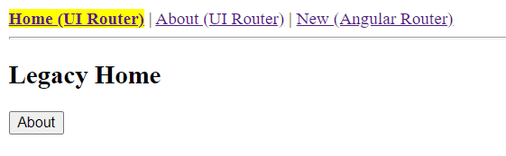

# NgHybridRouters

This project is a proof of concept of using both https://angular.io/guide/router:[Angular Router] and https://ui-router.github.io/ng2/:[UI-Router] within an Angular 10 app.

This is useful to progressively migrate to Angular Router a legacy ng2+ app that is using UI-Router.

This app consists in a navbar that navigates within 3 screens:

* link:src/app/home["home"]: managed by UI-Router
* link:src/app/about["about"]: managed by UI-Router with a parameter
* link:src/app/new["new"]: managed by Angular Router

Both routers are configured to use the same URL naming with `#`.

As each router owns its view tag (`<router-outlet>` for Angular Router and `<ui-view>` for UI-Router) the trick is to keep both and to define "catch-all" routes/states that are responsible for emptying the view when the route is managed by the other router.

For UI-Router, there is a state definition that renders an empty ui-view for unknown routes (i.e. the ones managed by Angular Router).

[source,typescript]
----
export const catchAllState = {
  parent: 'app',
  name: 'unknown',
  url: '/**',
  views: {
    'content@': { component: EmptyUiViewComponent}
  }
};
----

Similarly, for Angular Router, there is a route definition that renders an empty router-outlet for unknown routes (i.e. the ones managed by UI-Router).

[source,typescript]
----
  {path: '**', component: EmptyRouterOutletComponent},
----

As a consequence of this trick, links must use directives from both routers in order to notify them:

* `uiSref` and `uiParams` for UI-Router
* `routerLink` and `routerLinkActive` for Angular Router

[source,html]
----
    <a uiSref="new" routerLink="/new" routerLinkActive="active">New (Angular Router)</a>
----

See link:src/app/navbar/navbar.component.html[navbar.component.html]

Similarly to links that must notify both routers, programmatic navigation should also do the same:

[source,typescript]
----
  goToAbout(): void {
    this.stateService.go('about', { origin: 'button (New)' }, { reload: true });
    this.router.navigate(['/about']);
  }
----

Another annoyance is that unknown routes do not update URL, so we get +++http://localhost:4200/#/**+++
 which prevents deep linking, so it's better to define full states in UI-Router for Angular routes and to limit the use of `/**` catch-all state. See link:src/app/app.states.ts[app.states.ts]

Of course, this is only a temporary hack and all traces of UI-Router will get removed once al states have been converted to Angular routes but it helps focusing on one change and then moving to next one rather than using a big bang approach and being overwhelmed by navigation bugs.

== Development server

This project was generated with https://github.com/angular/angular-cli:[Angular CLI] version 10.1.2.

Run `ng serve` for a dev server. Navigate to `http://localhost:4200/`. The app will automatically reload if you change any of the source files.

